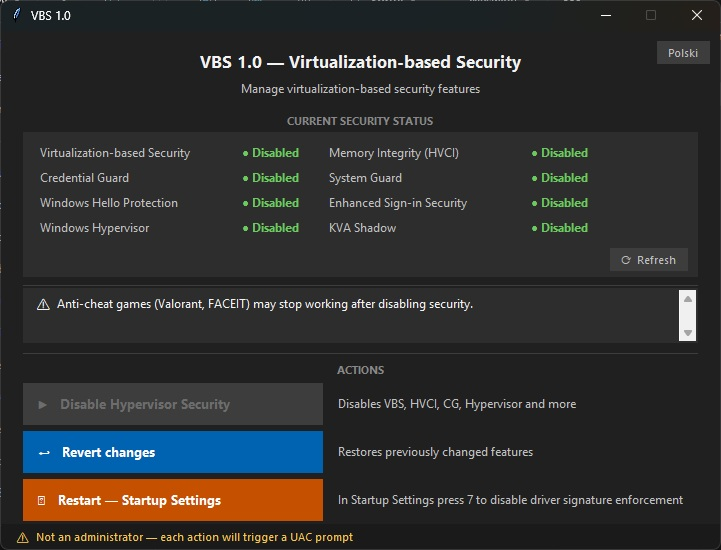
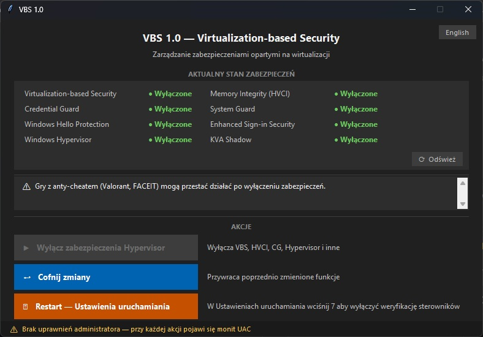

# VBS 1.0 — Virtualization-based Security Manager

> A simple, clean GUI tool for managing Windows security features that can affect gaming performance and driver compatibility.
> Especially useful for **gaming handhelds** like ASUS ROG Ally, Lenovo Legion Go or MSI Claw — where every frame counts and there is no physical keyboard to run command-line tools.

---

## Screenshots

---

## What is this?

Modern versions of Windows 10 and 11 come with a set of security features based on **hardware virtualization** (Hyper-V). While these features improve security, they can also:

- **Lower gaming performance** — especially in CPU-intensive games
- **Block unsigned or older drivers** — causing issues with some hardware or software
- **Conflict with anti-cheat systems** — some games (e.g. Valorant, FACEIT) have problems running alongside these features

**VBS 1.0** gives you a straightforward graphical interface to view the current status of these features and disable or restore them — no command line needed.

This tool is particularly useful for **gaming handheld devices** such as the ASUS ROG Ally, Lenovo Legion Go or MSI Claw. On these devices VBS and HVCI are often enabled by default and can noticeably reduce gaming performance — disabling them is one of the first tweaks most handheld owners do.

---

## Features at a glance

| Feature | What it does |
|---|---|
| **Live status panel** | Shows the current state of all 8 security features at a glance |
| **Disable Hypervisor Security** | Turns off VBS, HVCI, Credential Guard, System Guard, Windows Hello Protection, Windows Hypervisor, Enhanced Sign-in Security and KVA Shadow |
| **Revert changes** | Restores all previously disabled features back to their original state |
| **Restart — Startup Settings** | Reboots directly into the Windows Startup Settings screen, where you can press **7** to disable driver signature enforcement (useful for installing unsigned drivers) |
| **Smart button graying** | Buttons are automatically disabled when the action they perform is not needed |
| **Auto dark / light theme** | The interface matches your Windows color scheme — dark or light |
| **Language switching** | Automatically uses Polish when your Windows language is set to Polish; otherwise uses English. You can switch manually via the button in the top-right corner |
| **DPI scaling** | The UI scales correctly on high-DPI monitors (125%, 150%, 200%) |
| **UAC elevation** | All registry operations require administrator rights — the tool handles UAC prompts automatically |

---

## Security features explained (plain language)

| Feature | What it is |
|---|---|
| **Virtualization-based Security (VBS)** | The main feature — uses the CPU's virtualization engine to create an isolated area of memory, protecting the system core |
| **Memory Integrity (HVCI)** | Checks that drivers and kernel code haven't been tampered with; can conflict with older drivers |
| **Credential Guard** | Protects login credentials (passwords, tokens) from being stolen by malware |
| **System Guard** | Verifies that the system hasn't been modified during startup |
| **Windows Hello Protection** | Secures PIN/fingerprint/face login using the isolated memory zone |
| **Enhanced Sign-in Security** | Additional layer of protection for the sign-in process |
| **Windows Hypervisor** | The low-level virtualization engine that all the above features rely on |
| **KVA Shadow** | A mitigation for the Spectre/Meltdown CPU vulnerabilities; can slightly reduce performance |

---

## How to use

1. **Download** the latest `.exe` from [Releases](https://github.com/gangg111/VBS/releases) (or run `vbs_gui.py` directly with Python 3)
2. **Run** the application — no installation required
3. If you are **not running as administrator**, a UAC prompt will appear when you click an action button — this is expected and required
4. After disabling features, **restart your computer** when prompted

> ⚠️ **Before disabling:** If you use Windows Hello (PIN, fingerprint or face login), disable it first in *Settings → Accounts → Sign-in options*. Otherwise Windows may prevent the changes.

> ⚠️ **Anti-cheat note:** Games like Valorant and FACEIT may stop working after disabling VBS/HVCI. Use **Revert changes** to restore everything if needed.

---

## Requirements

- Windows 10 (version 1903 or newer) or Windows 11
- No installation required — just run the `.exe`

---

## How to install

1. Go to [Releases](https://github.com/gangg111/VBS/releases)
2. Download the latest `VBS.zip`
3. Run it — that's it

---

## Inspiration

This project was inspired by a **VBS.cmd** batch script I came across — a command-line tool that performed the same registry operations. I don't know who the original author is or where their repository is hosted, but their work gave me the idea to build a proper graphical interface around the same logic. If you recognize the original script, feel free to open an issue so I can credit them properly.

---

## Disclaimer

Disabling security features reduces the protection level of your system. Only do this if you understand the trade-offs and have a specific reason (gaming performance, driver compatibility, etc.). You can always restore everything using the **Revert changes** button.

---

## License

MIT
